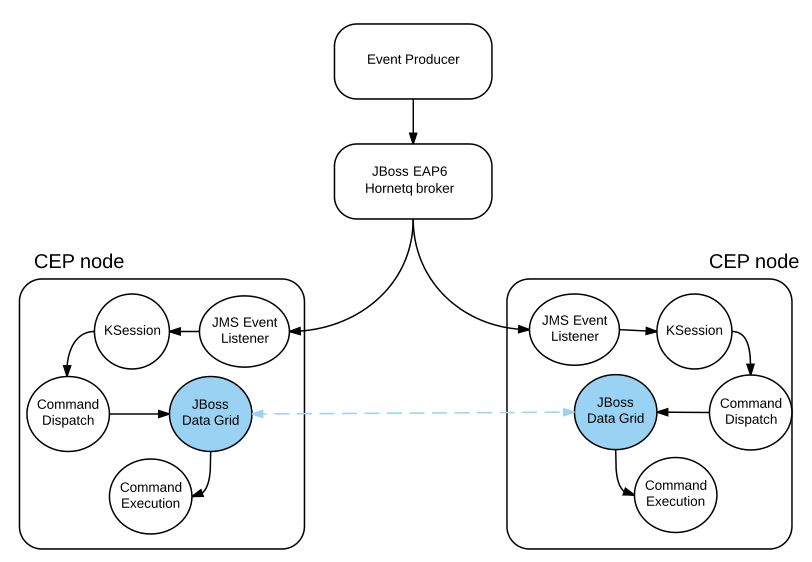

:data-uri:
:toc-placement: preamble
:toc: manual
:rhtlink: link:https://www.redhat.com[Red Hat]
:mwlaboverviewsetup: link:http://people.redhat.com/jbride/labsCommon/setup.html[Middleware Lab Overview and Set-up]
:brmsproduct: link:https://access.redhat.com/documentation/en-US/Red_Hat_JBoss_BRMS/[Red Hat JBoss BRMS 6]
:datagridproduct: link:https://access.redhat.com/documentation/en-US/Red_Hat_JBoss_Data_Grid/[Red Hat JBoss Data Grid]
:eapproduct: link:https://access.redhat.com/documentation/en-US/JBoss_Enterprise_Application_Platform/[JBoss Enterprise Application Platform]
:haceppreso: link:http://www.slideshare.net/DuncanDoyle/doyle-h-0945highavailablitycepwithredhatjbossbrms3[High Available Complex Event Processing presentation]
:hacepgitrepo: link:https://github.com/DuncanDoyle/RHSummit2014HaCepBrms[source code]

= Highly Available JBoss BRMS CEP

*Goal*
Configure a highly available JBoss BRMS CEP solution

:numbered:

== Overview
This document reviews a solution for high availability of Red Hat JBoss BRMS Complex Event Processing (CEP) engines.
It provides both an overview of the solution's various components and step-by-step instructions to reproduce the solution.

The mock business scenario utilized in this project is that of baggage handling at an airport.
Baggage is tracked throughout its processing at the airport and as it reaches various check-points, events are produced and sent to the BRMS CEP engines.
Most importantly, the CEP based solution is able to identify if and when a particular bag has been lost.

Because visibility of baggage is of critical importance at an airport, one requirement of the CEP based baggage tracking system is that it be highly available.
In particular, baggage status events must be processed by the solution in a reliable and deterministic manner even during CEP node failure.

== Credits
This project builds upon the outstanding contributions of Duncan Doyle and the Red Hat BRMS engineering team.

In particular, Duncan's {haceppreso} and {hacepgitrepo} are the basis of this project.

== Pre-Requisites

The following is a list of pre-requisites needed to execute this project:

. Familiarity with Complex Event Processing
. Familiarity with {brmsproduct}
. Familiarity with {datagridproduct}
. Familiarity with {eapproduct}
+
In particular, its messaging broker:  HornetQ
. Access to the Red Hat Support Portal and entitlements to Red Hat JBoss middleware.
. Workstation with the following specs:
.. 4G RAM
.. 4 CPU cores
.. JDK 7 (or more recent)
.. Maven 3.3.1 (or more recent)
.. git client
.. root access

== Deployment Topology

.ha_cep deployment topology

== Components
This section of the guide provides an overview of the major components utilized in this `High Availability CEP project`.

It is recommended that you initially skim through this section.
Afterwards, feel free to <<clone>> and refer back to this section as you comb through the details of the source code and configuration files.

=== *Bag Scanned* Events
15 mock `bag scanned` events are provided in this project.
Each event has one of the following statuses:

. *CHECK_IN*
. *SORTING*
. *STAGING*
. *LOADING*

Also included in the event is an `EVENT ID`, `BagTag UUID` and a Date (specific to the millisecond).

These `bag scanned` events are sent to a JMS topic managed by the JBoss EAP Hornetq broker called: `EventTopic`.

Refer to the following source code:

* `RHSummitHaCepEventProducer/src/main/resources/events.csv`
* `RHSummitHaCepEventProducer/src/main/java/org/jboss/ddoyle/rhsummit2014/hacepbrms/eventproducer/FactsLoader.java`
* `RHSummitHaCepEventProducer/src/main/java/org/jboss/ddoyle/rhsummit2014/hacepbrms/eventproducer/JmsRouter.java`

=== CEP Engine

==== Knowledge Session Mgmt
Each CEP node in the HA cluster makes use of a `stateful` Drools knowledge session.
This stateful Drools ksession is instantiated and managed by two classes: `SessionManager` and `SessionProducer`.

==== JMS Event Listener
One of the first tasks that occurs during creation of the ksession is that a single JMS consumer is started.
This JMS consumer listens for and consumes `BagScannedEvent` messages from the JMS destination: `EventTopic`.

Upon consumption, inserting of the event/fact into the ksession is delegated to a class called `PseudoClockFactInserter`.
The `PseudoClockFactInserter` inserts facts into the ksession in a deterministic manner.
In particular, it fires the rules and advances its Drools `pseudo` clock with the consumption of every event.

==== Firing of Rules

Many simple complex event processing examples make use of `ksession.fireUntilHalt()` function.
This `fireUntilHalt` function delegates the rule firing to the Drools ksession and is very convenient.
However, the behavior of the `fireUntilHalt` function is not deterministic across different CEP engines in a cluster.
With `fireUntilHalt`, the actual firing of rules may occur with the introduction of a varying amount of facts into working memory.

In this project, firing of rules occurs just after insertion of every event/fact into working memory.
Other strategies for firing of rules are possible (ie: after a pre-determined batch size of events or `poison-pills`).
Duncan explains these strategies in his {haceppreso}.

==== Clock Mgmt
An important strategy in this project is to make use of a Drools `pseudo` clock rather than the hardware's real-time clock.
A `pseudo` clock can be controlled and is a requirement to keep identical agendas / working memory from different ksessions executing on different CEP nodes in the cluster.
Correspondingly, this allows for the replay of previous events in a deterministric manner.
Replay of previous events is important for a CEP node that is either new to the cluster or re-joins the cluster due to previous failure.

At CEP node start-up, the ksession's pseudo-clock is initially set to the Unix epoch time: Jan 1, 1970 00:00:00 UTC.
The pseudo clock is continuously advanced with the consumption of each event based on the event's timestamp.

==== Source Code

* `RHSummitHaCepApp/src/main/java/org/jboss/ddoyle/brms/cep/ha/drools/session/SessionManager.java`
* `RHSummitHaCepApp/src/main/java/org/jboss/ddoyle/brms/cep/ha/drools/session/SessionProducer.java`
* `RHSummitHaCepApp/src/main/java/org/jboss/ddoyle/brms/cep/ha/input/messaging/EventListener.java`
* `RHSummitHaCepApp/src/main/java/org/jboss/ddoyle/brms/cep/ha/input/PseudoClockFactInserter.java`

=== *BaggageLostAtSorting* rule
This project provides a single CEP rule called: `BaggageLostAtSorting`.
The rule accepts events sent to an entry point called: `RHSummitStream`.

The purpose of the rule is to identify `BagScannedEvents` whose status has not changed from `CHECK_IN` to `SORTING` within a 10 minute time window.

In this HA CEP solution, execution of business logic in the right-hand side of the rule is done in a deterministic manner.
In particular, the business logic is not hard coded in the right-hand side of the rule.
Instead, a uniquely identifiable `Command` object is created.
Execution of this `Command` object is delegated to other functionality whose responsibility it is to ensure that the command is fired once-and-only-once across the HA CEP cluster.

Refer to the following source code:

* `RHSummitHaCepRules/src/main/resources/rules/airport-rules.drl`

=== SystemOutCommand
If and when the rule fires, a new `SystemOutCommand` object is created.

For the purposes of this demo project, the `SystemOutCommand` object simply logs a message to output.
Real-world business applications would likely make use of a `Command` object that invokes business logic.

The identifier of the `SystemOutCommand` must be unique and deterministically computed across different CEP nodes in the cluster.
In this project, the identifier of the `SystemOutCommand` is a concatentation of the following:

. *rule package name*
. *ruleId*
. *rule name*
. *event id*

An example command identifier is as follows:

`org.jboss.ddoyle.rhsummit2014.bags:BaggageLostAtSorting:BaggageLostAtSorting-[10]`

After creation, the `SystemOutcommand` object is delegated for further processing to the `CommandDispatchChannel`.

Refer to the following source code:

* `RHSummitHaCepCommands/src/main/java/org/jboss/ddoyle/rhsummit2014/hacepbrms/command/SimpleCommandFactory.java`
* `RHSummitHaCepCommands/src/main/java/org/jboss/ddoyle/rhsummit2014/hacepbrms/command/CommandIdBuilder.java`
* `RHSummitHaCepCommands/src/main/java/org/jboss/ddoyle/rhsummit2014/hacepbrms/command/CommandIdGenerator.java`

=== Command Dispatch
`SystemOutCommand` objects (created in the consequence of the `BaggageLostAtSorting` rule) are delegated to the `CommandDispatchChannel` object for further processing.
`CommandDispatchChannel` is an `ApplicationScoped` CDI bean that implements the `org.kie.api.runtime.Channel` interface.

The `CommandDispatchChannel` operates in conjunction with a different `ApplicationScoped` CDI bean called: `InfinispanidempotantCommandDispatcher`
Collectively, these two beans are responsible for putting the `SystemOutCommand` object on a replicated and synchronized JBoss Data Grid cache called: `commandsCache`.

As per the following code snippet, Infinispan's `cache.putIfAbsent(....)` function is utilized:

-----
...

Command oldCommand = cache.putIfAbsent(command.getId(), command, ..);
if (oldCommand == null) {
    LOGGER.debug("INSERTED COMMAND with ID: " + command.getId());
    commandExecutionService.execute(command);
} else {
    LOGGER.debug("IGNORED COMMAND BECUASE IT ALREADY EXISTS AND FIRED");
}

...
-----

Infinispan's `putIfAbsent(...)` function is atomic (either fully commits or rolls back) and consistent (read always returns the most recently written value) across the CEP nodes in the cluster.

Refer to the following source code:

* `RHSummitHaCepApp/src/main/java/org/jboss/ddoyle/brms/cep/ha/drools/channel/CommandDispatchChannel.java`
* `RHSummitHaCepApp/src/main/java/org/jboss/ddoyle/brms/cep/ha/command/dispatch/InfinispanIdempotantCommandDispatcher.java`

=== JBoss Data Grid

In this project, JBoss Data Grid is used to store at most one unique instance of a `SystemOutCommand` object across a cluster of CEP nodes.
The name of the cache that stores the `SystemOutCommand` objects is called: `commandsCache`.

The JDG cache runs embedded (aka:  Library Mode) in the CEP application.
State transfer of data between nodes is `replicated` to all nodes in the cluster in a `synchroneous` (aka: blocking) manner.
These attributes of the JDG cache are critical to this project.
They ensure that the `SystemOutCommand` objects are fired with a once-and-only-once guarantee across CEP nodes in the high avaliability cluster.

Refer to the following source code:

* `RHSummitHaCepApp/src/main/resources/infinispan/infinispan.xml`

=== Command Execution
`ApplicationScoped` CDI bean that executes the `SystemOutCommand`.

The `SimpleCommandExecutionService` executes on a `SystemOutCommand` once its been previously determined that the `SystemOutCommand` object is not already in the `commandsCache`.

== Procedure

[[clone]]
=== Clone this project

. In your local workstation, open a terminal window and switch to a non-root operating system user.
. Clone this project from github:
+
-----
git clone https://github.com/jboss-gpe-ref-archs/ha_cep.git
-----
+
A new directory called `ha_cep` should have been created.
+
For the purposes of this documentation, the name _$LAB_HOME_ refers to the absolute path on your local workstation to this new _ha_cep_ directory.

=== Configure and Start JBoss EAP6 Hornetq Broker
In this project, a single JBoss EAP 6 JVM will be configured and started to provide messaging requirements.

. From the Red Hat Support Portal, download the latest JBoss Enterprise Application Platform (EAP).
+
At the time of this writing, (June, 2015) JBoss EAP 6.4 is the latest and subsequently the download is:  `jboss-eap-6.4.0.zip`.
. Move this download to the following directory: `$LAB_HOME/demo/installation_zips`
. Change directory to `$LAB_HOME/demo` and execute:
+
-----
./setup-scripts/buildJBossEap-HaCepBrms-Demo-Environment.sh
-----
+
Executing this script does the following:

.. Unzips JBoss EAP in the `demo/target` directory
.. Creates a new JBoss EAP server configuration file called: `hacepbrms-standalone-full.xml`
.. Creates an `EventTopic` JMS topic

. From `$LAB_HOME/demo`, execute the following to start JBoss EAP as a background OS process:
+
-----
nohup target/jboss-eap-6.4/bin/standalone.sh -c hacepbrms-standalone-full.xml -b 127.0.0.1 -bmanagement 127.0.01 > target/eap.log 2>&1 &
-----
. If interested, the log file for this JBoss EAP background process can be tailed from the `$LAB_HOME/demo` directory as follows:
+
-----
tail -f target/eap.log
-----

=== Configure Maven
This project makes use of support Red Hat JBoss Maven repositories.
Most Maven libraries can be obtained from the Red JBoss `techpreview` Maven repo at:
`http://maven.repository.redhat.com/techpreview/all/`

The exception to this is the current use of JBoss Data Grid 6.5-Beta.
The off-line Maven repository for JBoss Data Grid 6.5-Beta is available from the Red Hat Support Portal and should be downloaded and unzipped to your local workstation.

A sample Maven `settings.xml` file to support this project can be found at: `$LAB_HOME/demo/maven/jdg-offline-settings.xml`

. Copy the sample `jdg-offline-settings.xml` file to your OS user's standard maven configuration directory:
+
-----
cp $LAB_HOME/demo/maven/jdg-offline-settings.xml ~/.m2
-----
. Read through contents of `~/.m2/jdg-offline-settings.xml` and make adjustments as indicated in that file.

=== Build project
This project contains the source code to the various components that make up a highly available CEP deployment topology.
As such, these components need to be built from source.

. cd $LAB_HOME
. execute:
+
-----
mvn clean compile -s ~/.m2/jdg-offline-settings.xml
-----

=== Start CEP Nodes

==== Overview
The CEP functionality is found in the subproject: `$LAB_HOME/RHSummitHaCepApp`.

In this section of the lab, multiple standalone CEP JVMs will be started and the following will occur:

. Each CEP node will reate a JMS connection to the Hornetq messaging broker of JBoss EAP 6.
. Each CEP node will begin to consume events from the `EventTopic` managed in the Hornetq broker.
. Each CEP node will discover other CEP nodes using UDP multi-cast
. A TCP based JDG/Jgroups `Library-mode` cluster will be formed between the nodes that are discovered.
. Each CEP node will create and manage a CEP knowledge session

==== Procedure
. cd `$LAB_HOME/RHSummitHaCepApp`
. Start CEP node 1:
+
-----
mvn exec:java -s ~/.m2/jdg-offline-settings.xml
-----
. Start CEP node 2:
+
-----
mvn exec:java -s ~/.m2/jdg-offline-settings.xml -Drhsummit2014.hornetq.client.id=rhsummit2014-hq-client-2
-----

=== Start Event Producer Client
At this point, you should have a JBoss EAP/HornetQ and 2 CEP JVMs running on your local workstation.
The final JVM needed in this project is the `Bag Scanned Event` producer.
This JVM sends messages to the `EventTopic` managed by the Hornetq broker.

. Open a new terminal window
. cd `$LAB_HOME/RHSummitHaCepEventProducer/`
. start the CEP event producer
+
-----
mvn exec:java -s ~/.m2/jdg-offline-settings.xml
-----
+
You'll notice that output of this JVM indicates that 15 events were sent to the JMS broker.

=== Review Results

With the 15 events having been processed, study and compare the output of both CEP nodes.
Notice that for a given `Command` object, one node will log the following"

-----
DEBUG INSERTED COMMAND with ID: 'org.jboss.ddoyle.rhsummit2014.bags:BaggageLostAtSorting:BaggageLostAtSorting-[14]' into cache.
DEBUG EXECUTING COMMAND: org.jboss.ddoyle.rhsummit2014.bags:BaggageLostAtSorting:BaggageLostAtSorting-[14]
Command-ID: org.jboss.ddoyle.rhsummit2014.bags:BaggageLostAtSorting:BaggageLostAtSorting-[14]
Message: Baggage lost at sorting. BagTag ID: 8
-----

and the other node will log this:

-----
DEBUG IGNORING COMMAND with ID: 'org.jboss.ddoyle.rhsummit2014.bags:BaggageLostAtSorting:BaggageLostAtSorting-[14]' as it has already been executed earlier.
-----

What has occurred is that the rules of both CEP nodes have fired in an identical deterministic manner.
However, the Command object from only one node has actually executed.

Congratulations!  You have now set up and tested a highly available complex event processing solution.

=== Test Replay Behavior

. Stop one of the CEP engines and start it again.
. Resend the original 15 `Bag Scanned Events`
+
Notice that the `BaggageLostAtSorting` rule will fire as before however all of the events will be ignored because they already exist in the cache.

== Questions
. @Infinispan
+
Implemented by both InfinispanIdempotantCommandDispatcher and SimpleCommandExecutionService ?

== TO-DO
. *Node (re)initialization*
+
Currently, to verify that old events are not re-executed (when a new node comes online or an old node recovers from failure), the event producer sends the same 15 events in the correct order.
+
(re)initialization of nodes is a common requirement of blockchain technologies (ie: bitcoin, nxt) as well.
Nodes are brought up to current state of the network as of the last mined block (~ 10 minutes for bitcoin and ~ 1 minute for nxt).
Once fully initialized (ie; full copy of block database is local), nodes are able to participate in the mining.
. *HA JMS*
+
Hornetq JMS broker should be configured for HA

. *JMX Console* to view entries in cache

ifdef::showScript[]

=== Configure *IP Aliasing*

This project assumes that multiple aliases on the `localhost` network interface of your workstation have been created.
Doing so allows the different JVMs of this project to run on the same operating system without network port conflicts.

`IP Aliasing` is straight-forward with a modern Linux distribution.

. In your local workstation, open a terminal window and switch users to: `root`
. View the `localhost` interface using the command: `ip addr list dev lo`
+
-----
[root@carbon ~]# ip addr list dev lo
1: lo: <LOOPBACK,UP,LOWER_UP> mtu 65536 qdisc noqueue state UNKNOWN
link/loopback 00:00:00:00:00:00 brd 00:00:00:00:00:00
inet 127.0.0.1/8 scope host lo
valid_lft forever preferred_lft forever
inet6 ::1/128 scope host
valid_lft forever preferred_lft forever
-----
. Add additional aliases:
+
-----
ip addr add 127.0.0.2/24 dev lo
ip addr add 127.0.0.3/24 dev lo
ip addr add 127.0.0.4/24 dev lo
-----
. View the details `localhost` interface again.
The new aliases should appear:
+
-----
[root@carbon ~]# ip addr list dev lo
1: lo: <LOOPBACK,UP,LOWER_UP> mtu 65536 qdisc noqueue state UNKNOWN
link/loopback 00:00:00:00:00:00 brd 00:00:00:00:00:00
inet 127.0.0.1/8 scope host lo
valid_lft forever preferred_lft forever
inet 127.0.0.2/24 scope host lo
valid_lft forever preferred_lft forever
inet 127.0.0.3/24 scope host secondary lo
valid_lft forever preferred_lft forever
inet 127.0.0.4/24 scope host secondary lo
valid_lft forever preferred_lft forever
inet6 ::1/128 scope host
valid_lft forever preferred_lft forever
-----

endif::showScript[]
